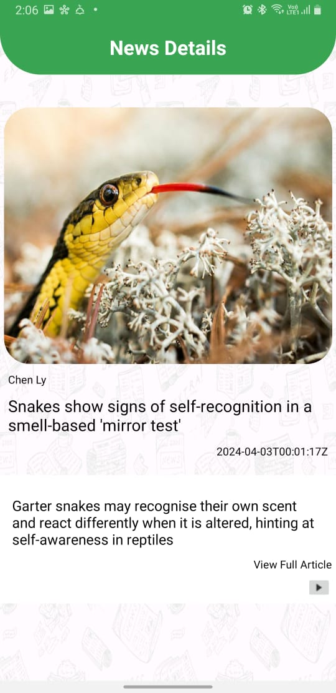
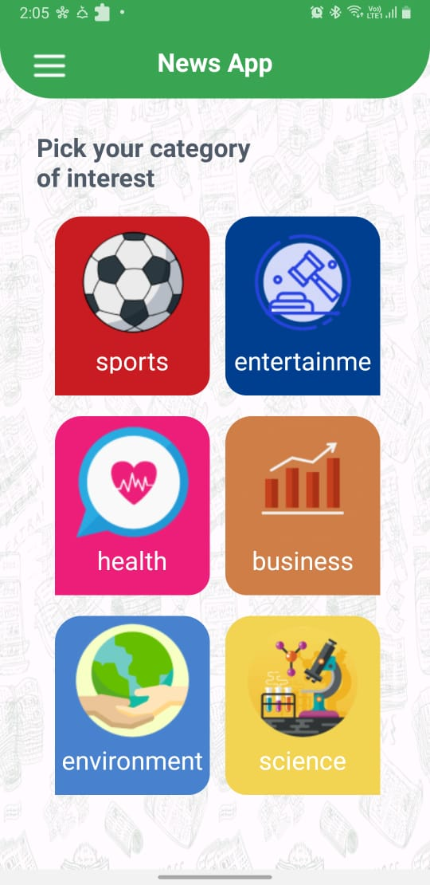

# Global News App

## Overview

The Global News App, built with Kotlin, offers a comprehensive and engaging news experience by aggregating and displaying news from around the world. The app provides real-time updates on global events, breaking news, and trending topics, ensuring users stay informed wherever they are.

## Features

- **Global Coverage:** Aggregates news articles from reputable international publishers.
- **Personalized Content:** Offers personalized news recommendations based on user interests.
- **Intuitive User Interface:** Clean and intuitive interface for easy navigation and customization.
- **Multimedia Integration:** Supports multimedia content such as images, videos, and interactive graphics.
- **Real-Time Updates:** Provides real-time notifications for breaking news alerts and updates.
- **Offline Reading:** Allows users to save articles for offline reading.
- **Accessibility and Localization:** Supports multiple languages and accessibility features.

## Technology Stack

- **Programming Language:** Kotlin
- **Backend Services:** RESTful APIs
- **Database:** SQLite
- **Development Tools:** Android Studio, Firebase

## Future Enhancements

- Integration of natural language processing (NLP) algorithms for summarizing articles.
- Implementation of social sharing features.
- Integration with wearable devices for news updates.
- Continuous optimization and refinement based on user feedback.

## Screenshots

## Installation

1. Clone the repository:

git clone https://github.com/zeyad1910/News.git

Copy code

2. Open the project in Android Studio.

3. Build and run the app on an Android device or emulator.

## Contributions

Contributions are welcome! Please feel free to submit issues or pull requests.

